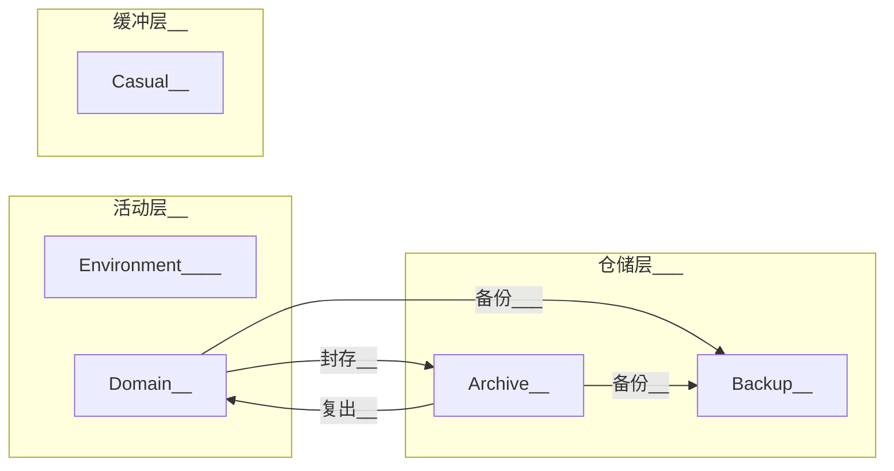

> Tiki_Essential直属模组, 许可协议: IceTiki [知识共享 署名-相同方式共享 4.0协议](https://creativecommons.org/licenses/by-sa/4.0/deed.zh) 2021

# 前言

以下关键词 MUST、MUST NOT、REQUIRED、SHALL、SHALL NOT、SHOULD、SHOULD NOT、 RECOMMENDED、MAY、OPTIONAL 依照 RFC 2119 的叙述解读。

当文件或文件夹名出现尖括号时```<内容>```，代表这部分需要被替换为合理的值。

## ==实例==

文件列表

> * *.git
> * \_\_index\_\_.md     >>>>>     模组主体文件的副本
> * backup.md     >>>>>     备份说明

## ==调用==

### <span id='Access'>Access</span>

<span id='keyIndex'>keyIndex</span> = Access.keyIndex(“File_Management”)     >>>>>     创建密钥索引

### Index

<span id='trigger'>trigger</span> =  Index.trigger(“File_Management”)     >>>>>    创建触发器

## 接口

## 须知


## 简述

文件管理系统围绕[领域](#领域)的整理文件。

文件管理以[价值-状态体系](#说明_价值-状态体系)将文件分为三层——缓冲层、活动层、仓储层。进而分为五个区域。

其中**最重要的区域是Domain**——存放[领域](#领域)的文件夹。




# 正文

## 结构

个人的各类储存空间(硬盘、网盘、NAS等)，都各自划分为五大一级文件夹。

| 英文名               | 中文名 | 描述                       | 作用                                   |
| -------------------- | ------ | -------------------------- | -------------------------------------- |
| [Domain](#领域)      | 领域   | 长期活动领域               | 集合领域资源                           |
| [Casual](#临时)      | 临时   | 提供临时空间或存放临时文件 | 中转、实验、临时空间等                 |
| [Environment](#环境) | 环境   | 运行所需的基本环境         | 存放软件、辅助文件、脚本等辅佐生产文件 |
| [Archive](#存档)     | 存档   | 非活跃领域存放处           | 暂时封存领域                           |
| [Backup](#备份)      | 备份   | 重要文件的备份             | 容灾                                   |

### <span id='临时'>Casual</span>

本区域存放临时存放文件的文件夹和临时文件夹[示例](#示例_Casual结构)

| 结构                        | 命名格式     | 作用                                           |
| --------------------------- | ------------ | ---------------------------------------------- |
| 临时存放文件的文件夹(Stage) | S_<文件夹名> | 固定的临时存放文件区域(一般是应用固定输出路径) |
| 临时文件夹(Temporary)       | T_<文件夹名> | 临时创建(也可随时删除)文件夹                   |

### <span id=环境>Environment</span>

本区域存放软件等辅助正常工作的事物。

* 本二级结构命名**(MUST)**只能由英文字母、数字、下划线组成(不能以数字开头)^有特殊字符的目录容易产生错误^
* 各软件必须**(MUST)**安装于各自的独立文件夹(三级结构)中(建议用软件安装时的默认文件夹名)[示例](#示例_Environment结构)

### <span id='领域'>Domain</span>

本区域存放活跃中的[领域](#说明_领域)。


### <span id='存档'>Archive</span>

本区域存放封存状态下的[领域](#说明_领域)。

### <span id='备份'>Backup</span>

存放文件备份。

> 当磁盘空间不足时，会优先清理备份。所以Backup不能作为文件孤本存档处。

#### 创建备份库

备份库(MUST)是有```B_```前缀的文件夹，存放备份。

(MAY)一般一个[对象](#对象)(以及其所有子对象)对应一个备份库，(RECOMMENDED)命名格式为```B_<备份库标题>_<识别号>```

> **相关建议**
>
> 备份库中的内容(MAY)可以分为三类
>
> 1. 可变对象的增量备份区，(RECOMMENDED)建议添加```A_```前缀
> 2. 不可变对象的备份，(RECOMMENDED)建议添加```I<保存年限>_```前缀
> 3. 可变对象的快照备份，(RECOMMENDED)建议添加```M<保存年限>_<备份时间>_```前缀

## 备份

备份是(正常工作机制之外的)容灾机制，不强制执行。

全域的详细备份方式以及备份计划记录在[backup.md](#实例)中(无格式要求)，定期任务(MUST)添加到[Trigger](#trigger)。

## <span id='标签'>标签</span>

标签是在[对象](#对象)中使用，记录在文件名中的信息。标签可以转换为字典。

* 在对象内部使用标签时，需要(MUST)先将其加入到[索引](#说明_索引)的tag_list.yml。

* [标准标签](__index__.assets\template_.fileManagement_Index\tag_list.yml)是必须(MUST)使用的标签，自定义标签可以根据模板编写。

#### 标签额外信息

有些格式标签的有额外信息，用于记录无法在文件名中储存的信息(如过长)，对解释标签信息起辅助作用。

这些额外信息记录在[索引](#说明_索引)的tag_extension.yml中([模板](__index__.assets\template_.fileManagement_Index\tag_extension.yml))。

### 标签格式

标签由```[]```包裹，由```,```分隔各键值对。标签视为键。(键(MUST NOT)不允许重复，如果多次出现则记录最后一个)

键值对的格式有两种

| 标签类型     | 描述                                        | 示例格式               | 转化为json                              |
| ------------ | ------------------------------------------- | ---------------------- | --------------------------------------- |
| Fixed        | 固定标签视为值为1的键值对                   | \[标签1,标签2,标签3]   | { "标签1": 1,  "标签2": 1,  "标签3": 1} |
| Format、Free | 格式标签和自由标签则以```键=值```的格式书写 | \[标签1=值1,标签2=值2] | {"格式标签1": 值1,  "格式标签2": 值2}   |

值可以是字符串、数组和字典。[详情](#说明_标签中的值格式)

### 标签类型

标签有三种类型

| 类型   | 中文名   | 简介                  |
| ------ | -------- | --------------------- |
| Fixed  | 固定标签 | 忽略值的(值为1)的标签 |
| Format | 格式标签 | 值有格式规定          |
| Free   | 自由标签 | 值没有格式规定        |

### 转义

转义字符为 ``` ` ```，以下字符在标签中需要转义

* 标签保留字符```, = [  ] ` ```

* Windows文件名保留字符```\ / : * ? " < > |```

## <span id='加密'>加密</span>

### 加密方式

#### 文件加密

本体系下的所有压缩包(MUST)都以下方式加密。

* (MUST)使用AES-256加密(比如.7z)进行加密
  * (OPTIONAL)勾选```文件名加密```选项
  * (RECOMMENDED)推荐使用<u>仅储存/无压缩</u>(大多数文件压缩率不高且高压文件不抗损坏)
* (MUST)添加密钥索引标签(```k```[标签](#标签))

#### 字符串加密

本体系下的字符串默认加密方式为AES-256加密，建议(RECOMMENDED)添加```_<密钥索引>```后缀

```yaml
AES-256参数: 
  密码: 对密钥进行sha-256，取前32位
  偏移量: 对密钥进行sha-256，取33-48位
  模式: CBC
  填充: pkcs7padding
  字符集: utf-8
  编码: Hex
```

### <span id='加密_密钥索引'>密钥索引</span>

密钥索引是字符串，注记密码。密钥索引可以在[keyIndex](#keyIndex)中查到相应密码。

### 密钥生成

* 所有密钥都需要记录在[keyIndex](#keyIndex)中

* 密钥索引为"0"，(MUST)代表无密码

## <span id=自动工具>自动工具</span>

https://github.com/IceTiki/FileManagementTool

# 附录

## 说明

### <span id='说明_价值-状态体系'>价值-状态体系</span>

运行此系统最稀缺的资源是**精力**和**磁盘空间**。本体系通过价值和状态两个维度分类，将文件系统分为三层。

缓冲层是低价值/价值待定的文件，一般是临时文件，应尽快处理(清理)。

仓储层是长期封存的文件，无需分散精力于此。

**活动层**是生产、生活的核心，也是本系统的**核心**。

|      |       低/待定价值        |                有价值                 |
| :--: | :----------------------: | :-----------------------------------: |
| 封存 |                          | **仓储层**（**Archive**、**Backup**） |
| 活跃 | **缓冲层**（**Casual**） | **活动层（Domain**、**Environment**） |

### <span id='说明_领域'>领域</span>

命名格式(MUST)为```<主题>_<标识符>```。

#### 领域以主题富集相关文件

创建领域的目的是**富集**某个方面的文件以提高使用**效率**。领域内部文件彼此都有较强的联系。各领域相对独立。

> 领域不追求[MECE](https://zh.wikipedia.org/wiki/MECE%E5%8E%9F%E5%88%99)(不重复不依赖)
>
> * 以单一的标准分类文件，容易使某些区域文件过多，而某些区域文件过少。不契合使用习惯。
> * 固定的标准无法适应人随时间的变化。

其内部文件分类基本**不作限制**。

> 减少限制，提升效率。

领域一般(RECOMMENDED)涵盖范围广，活跃时间长(数年甚至数十年)。

> 人的精力一般集中在少数几个较大的方面(比如主业、生活)等。
>
> 对于过大的领域可以考虑拆分(比如将生活拆分为生活影像、生活日记等)
>
> 可以创建“集散”领域，短期感兴趣的项目可以置入集散库中。

#### 领域是可变[对象](#对象)

领域是可变[对象](#对象)，拥有可变对象的所有特性。(MUST)有索引和标识符，(MAY)可以创建子对象。

#### 领域状态：活跃与封存

领域有两种状态：活跃/封存。分别存放在Domain/Archive中。

领域按照以下步骤转为封存状态时(转为活跃状态时反之)：

* (MUST)添加```A<保存年限>_```前缀。存档年限为四位数年份，超出年限存档即可(MAY)清理。(永久存档填9999)
* (RECOMMAND)建议[加密压缩](#加密)。

* (MUST)将领域从Domain移动到Archive

备注：领域的子对象可以(OPTIONAL)单独封存；但领域的父对象封存时，子对象也必须(MUST)封存。

### <span id='对象'>对象</span>

对象是文件或文件夹。(MUST)带有[索引](#说明_索引)和[标识符](#说明_标识符)。

分为[不可变对象](#说明_不可变对象)和[可变对象](#说明_可变对象)两种。可变对象内可以(MAY)存放不可变对象，但不可变对象内不能(MUST NOT)储存可变对象。

考虑到储存空间往往不是完整的一块，对象可以(OPTIONAL)[分散储存](#子对象)。

#### <span id='说明_索引'>索引</span>

索引是名为```.fileManagement_Index```文件夹([模板](__index__.assets/template_.fileManagement_Index)，[生成工具](#自动工具))，保存对象的元信息。

* ```index.yml```——此区域的信息
* ```tag_list.yml```——此区域通行的[标签](#标签)列表
* ```tag_extension.yml```——标签的额外信息，见[标签](#标签)

#### <span id='说明_标识符'>标识符</span>

对象都必须(MUST)在文件/文件夹名中标示标识符，可以以```_<标识符>```作为后缀或用```i```[标签](#标签)。

可变对象的标识符格式为```<英文和数字组成，长度为12的随机字符串>```

不可变对象的标识符格式为```<英文和数字组成，长度为16的随机字符串>```

子对象的标识符格式为```<父对象标识符>_<英文和数字组成，长度为8的随机字符串>```

```python
import random
for i in range(60):
    print(str().join(random.choices(
        'abcdefghijklmnopqrstuvwxyzABCDEFGHIJKLMNOPQRSTUVWXYZ0123456789', k=8+4*(i % 3))))
```

#### <span id='说明_不可变对象'>不可变对象</span>

不可变对象的内容不可(MUST NOT)变动，一个标识符对应一份内容。

创建不可变对象或改变其内容时，必须(MUST)新生成[标识符](#说明_标识符)。

#### <span id='说明_可变对象'>可变对象</span>

可变对象的内容可以变动。但在同一时间同一标识符的对象内容必须(MUST)完全相同。

> 换而言之，仅当完全自动同步的文件夹两个文件夹，可以用同一标识符同时出现在两个地方。

#### <span id='子对象'>子对象</span>

对象可以创建子对象以分散储存压力。

子对象空间是对象(父对象)空间的一部分，所以<u>子对象</u>空间的<u>一级子文件夹或一级文件</u>**(MUST NOT)**都<u>不能</u>与<u>其他子对象或父对象</u>的一级子文件夹或一级文件<u>重名</u>。

### <span id='说明_标签中的值格式'>标签中的值格式</span>

标签中的值可以是字符串、数组或字典。

数组和字典都以```[]```包裹(可以嵌套)，以```,```分割值或者键值对。如果数组中出现键值对，则将其视为字典。

| 值类型 | 示例格式[更多示例](#示例_标签示例)       | 转化为json                                                   |
| ------ | ---------------------------------------- | ------------------------------------------------------------ |
| 字符串 | \[标签1=这是一个字符串,标签2=两个字符串] | {"标签1":"这是一个字符串","标签2":"两个字符串"}              |
| 数组   | \[标签=[一个,两个,三个]]                 | {"标签":["一个","两个","三个"]}                              |
| 字典   | \[标签=[年=2021,月=8,日=16]]             | {"标签":{"年":"2021","月":"8","日":"16"}}                    |
| 字典   | \[标签=[日食,年=2021,月=8,日=16,月食]]   | {"标签":{"年":"2021","月":"8","日":"16","日食":"1","月食":"1"}} |

## 示例

### <span id='示例_Casual结构'>Casual结构示例</span>

> S_甲下载器下载目录
>
> S_手机照片自动同步目录
>
> S_待分类
>
> T_甲脚本临时测试区
>
> T_乙压缩包临时解压区

### <span id='示例_Environment结构'>Environment结构示例</span>

> * AppData
>   * qq缓存
>   * TIM缓存
>   * ...
> * Applications
>   * TIM
>   * qq
>   * ...
> * Component
>   * java7
>   * mingw
>   * ...
> * Tools
>   * typora
>   * git
>   * ...
> * Entertainment
>   * minecraft
>   * ...
> * Assist_File
>   * icon
>   * script
>   * ...

### <span id='#示例_标签示例'>标签示例</span>

| 描述   | 示例                                                         | 转json                                                       |
| ------ | ------------------------------------------------------------ | ------------------------------------------------------------ |
| 嵌套   | [标签1,标签2=这是一个字符串,标签3=[xxx=12,yyy=[yxx=random],zzz]] | {"标签1":1,"标签2":"这是一个字符串","标签3":{"xxx":12,"yyy":{"yxx":"random","zzz":1}}} |
| 转义   | 其他字符串[标签1,标\`=签2=这是一\`,个字符串,标签3=这也是一`]个字符串]其他字符串 | {"标签1":1,"标=签2":"这是一,个字符串","标签3":"这也是一]个字符串"} |
| 转义   | 其他字符串[标签1,标\`=签2=这是一\`,个字符串,标签3=这也是一]个字符串]其他字符串 | {"标签1":1,"标=签2":"这是一,个字符串","标签3":"这也是一"}    |
| 重复键 | 其他字符串[标签1,标签2=二十不是二,标签3=三十不是三,标签2=两百不是二,标签5=五百就是五百]其他字符串[标签3=三百不是三,标签4]其他字符串 | {"标签1":1,"标签2":"两百不是二","标签5":"五百就是五百","标签3":"三百不是三","标签4":1} |

