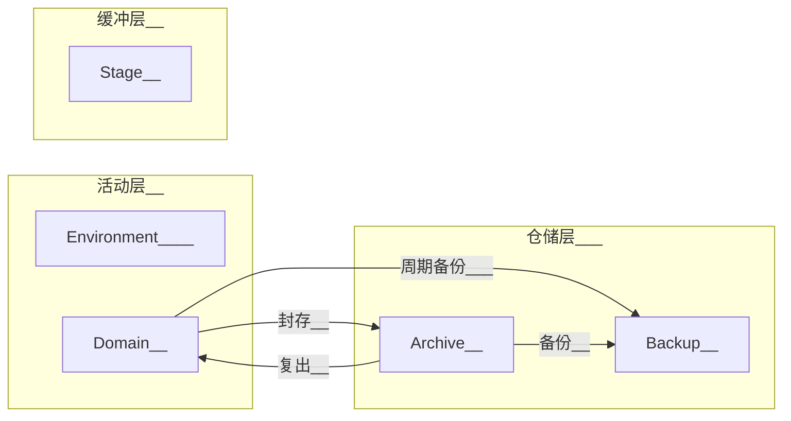
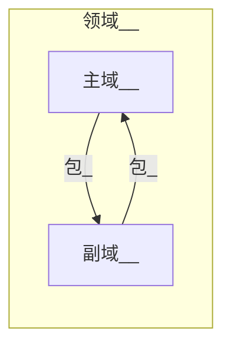

> Tiki_Essential直属模组, 许可协议: IceTiki [知识共享 署名-相同方式共享 4.0协议](https://creativecommons.org/licenses/by-sa/4.0/deed.zh) 2021

# 前言

以下关键词 MUST、MUST NOT、REQUIRED、SHALL、SHALL NOT、SHOULD、SHOULD NOT、 RECOMMENDED、MAY、OPTIONAL 依照 RFC 2119 的叙述解读。

当文件或文件夹名出现尖括号时```<内容>```，代表这部分需要被替换为合理的值。

## 实例

文件列表

> * *.git
> * \_\_index\_\_.md     >>>>>     模组主体文件的副本
> * <span id='文件_key'>key.xlsx</span>     >>>>>     密钥索引
> * backup.md     >>>>>     备份说明

## 调用

### <span id='Access'>Access</span>

提供**区域密钥**，**密钥生成**，以及**常用密码**。

### Index

提供**触发器**。

# 正文

## 一级结构

一级结构根据**[价值-状态体系](#说明_价值-状态体系)**分为**三层**，进而细分为**五大区**。



| 英文名               | 中文名 | 描述                       | 作用                                   |
| -------------------- | ------ | -------------------------- | -------------------------------------- |
| [Stage](#暂存)       | 暂存   | 提供临时空间或存放临时文件 | 中转、实验、临时空间等                 |
| [Environment](#环境) | 环境   | 运行所需的基本环境         | 存放软件、辅助文件、脚本等辅佐生产文件 |
| [Domain](#领域)      | 领域   | 长期活动领域               | 集合领域资源                           |
| [Archive](#存档)     | 存档   | 非活跃领域存放处           | 暂时封存领域                           |
| [Backup](#备份)      | 备份   | 重要文件的备份             | 容灾                                   |

## 二级结构

### <span id='暂存'>Stage</span>

本区域以**前缀**分两类二级结构[示例](#示例_Stage二级结构)

| 结构                        | 命名格式     | 作用                                           |
| --------------------------- | ------------ | ---------------------------------------------- |
| 临时存放文件的文件夹(Stage) | S_<文件夹名> | 固定的临时存放文件区域(一般是应用固定输出路径) |
| 临时文件夹(Temporary)       | T_<文件夹名> | 临时创建(也可随时删除)文件夹                   |

### <span id=环境>Environment</span>

* 必须**(MUST)**有[索引](#说明_索引)
* 本区域二级结构命名**(MUST)**只能由英文字母、数字、下划线组成(不能以数字开头)^有特殊字符的目录容易产生错误^
* 各软件必须**(MUST)**安装于各自的独立文件夹(三级结构)中(建议用软件安装时的默认文件夹名)[示例](#示例_Environment结构)

### <span id='领域'>Domain</span>

本区域有两类二级结构

| 结构 | 命名格式[备注](#说明_识别号)                  | 存放限制                 | 作用                                           |
| ---- | --------------------------------------------- | ------------------------ | ---------------------------------------------- |
| 主域 | <主域主题>_<主域16位识别号>                   | 无限制                   | 大型主题相关文件的集合[备注](#说明_领域的范围) |
| 副域 | <副域主题>\_<主域16位识别号>\_<副域8位识别号> | 只允许存放[包](#说明_包) | 分散主域文件(分散储存空间压力)                 |

**领域在所有磁盘空间的Domain和Archive分区有[唯一性](#说明_唯一性)**

#### 领域的结构

* 必须(MUST)有[索引](#说明_索引)
* 其他文件夹/压缩包命名(MUST NOT)不能与[包](#说明_包)冲突
* [包](#说明_包)(MUST)只能放在领域的一级目录中(三级结构)

#### 主域与副域

一个主域可以有多个副域，主域可以将[包](#说明_包)储存到副域中(分散储存空间压力)。

* **包在一个领域(包括主域以及其所有副域)中有[唯一性](#说明_唯一性)**
* 副域(MUST)**只能存放[包](#说明_包)**



### <span id='存档'>Archive</span>

本区域存放封存中的领域。

#### 封存机制

封存**领域**时(激活时反之)，必须(MUST)：

* 将领域压缩为压缩包。
* (MUST)添加```A<存档年限>_```前缀。存档年限为四位数年份，超出年限存档可随意删除。(永久存档可以填9999)

* (MUST)添加```_<密钥索引>```后缀。[密钥索引](#加密_密钥索引)

### <span id='备份'>Backup</span>

用于备份领域中的重要文件，防患于未然。

#### 创建备份

一个备份(MUST)对应一个领域(主域与所有副域)。

命名格式为```B_<备份主题>_<主域识别号>_<8位备份识别号>```——[识别号](#说明_识别号)

#### 备份机制

文件加入备份时，必须(MUST):

* 将文件打包为[包](#说明_包)(压缩包形式)

* 添加前缀
  * 如果包是临时有可变[结构](#说明_结构)打包而成，则添加```BT<存档年份>_```前缀。
    存档年限为四位数年份，超出年限存档可随意删除。(永久存档可以填9999)
  * 如果包本身是不可变[结构](#说明_结构)，则添加```B_```前缀

## 备份

全域的详细备份方式及定期备份时间记录在[backup.md](#实例)中，定期备份时间(MUST)需要在[Index](#Index)生成触发器。[示例](#示例_备份说明)

局域的备份方式记录在[索引](#说明_索引)中的[backup.yml](__index__.assets\template_.fileManagement_Index\backup.yml)中。

## <span id='标签'>标签</span>

标签是文件名的一部分，可以转换为字典。

### 标签格式

标签由```[]```包裹，由```,```分隔各键值对。标签视为键。(键(MUST NOT)不允许重复，如果多次出现则记录最后一个)

键值对的格式有两种

| 标签类型     | 描述                                        | 示例格式               | 转化为json                              |
| ------------ | ------------------------------------------- | ---------------------- | --------------------------------------- |
| Fixed        | 固定标签视为值为1的键值对                   | \[标签1,标签2,标签3]   | { "标签1": 1,  "标签2": 1,  "标签3": 1} |
| Format、Free | 格式标签和自由标签则以```键=值```的格式书写 | \[标签1=值1,标签2=值2] | {"格式标签1": 值1,  "格式标签2": 值2}   |

值可以是字符串、数组和字典。[详情](#说明_标签中的值格式)

### 标签类型

标签有三种类型

| 类型   | 中文名   | 简介                  |
| ------ | -------- | --------------------- |
| Fixed  | 固定标签 | 忽略值的(值为1)的标签 |
| Format | 格式标签 | 值有格式规定          |
| Free   | 自由标签 | 值没有格式规定        |

### 转义

转义字符为 ``` ` ```，以下字符在标签中需要转义

* 标签保留字符```, = [  ] ` ```

* Windows文件名保留字符```\ / : * ? " < > |```

### 装载

当某一区域使用标签时，需要先将其加入到[索引](#说明_索引)的tag_list.yml(标准标签也需加入)。

[标准标签](__index__.assets/std_tag.yml)是推荐(RECOMMENDED)使用的标签，而自定义标签可以根据[模板](__index__.assets\template_.fileManagement_Index\tag_list.yml)编写。

#### 标签额外信息

有些格式标签的有额外信息，用于记录无法在文件名中储存的信息(如过长)，对解释标签信息起辅助作用。

这些额外信息记录在[索引](#说明_索引)的tag_extension.yml中([模板](__index__.assets\template_.fileManagement_Index\tag_extension.yml))。

## <span id='加密'>加密</span>

### 加密方式

本文管理下的所有压缩包都以下方式加密。(解密时反之)

* 使用7zip进行加密(AES-256加密)
  * 勾选```文件名加密```选项
  * 推荐(RECOMMENDED)使用 仅储存/无压缩(大多数文件压缩率不高且高压文件不抗损坏)
* 添加```_<密钥索引>```后缀

### <span id='加密_密钥索引'>密钥索引</span>

密钥索引是有英文字母与数字组成的字符串。

密钥索引-唯一对应的密钥-说明 会成组储存[key.xlsx](#文件)中。并用[常用密码](#Access)加密。

### 密钥生成

* 所有密钥都需要记录在[key.xlsx](#文件)中

* 密钥索引为"0"代表无密码
* 密钥可以自定义，或者用[Access](#Access)提供的方法生成。

## <span id=自动工具>自动工具</span>

https://github.com/IceTiki/FileManagementTool

# 附录

## 说明

### <span id='说明_价值-状态体系'>价值-状态体系</span>

运行此系统最稀缺的资源是**精力**和**磁盘空间**。本体系通过价值和状态两个维度分类，将文件系统分为三层。

缓冲层是低价值/价值待定的文件，一般是临时文件，应尽快处理(清理)。

仓储层是长期封存的文件，无需分散精力于此。

|      |       低/待定价值       |                有价值                 |
| :--: | :---------------------: | :-----------------------------------: |
| 封存 |                         | **仓储层**（**Archive**、**Backup**） |
| 活跃 | **缓冲层**（**Stage**） | **活动层（Domain**、**Environment**） |

### <span id='说明_领域的范围'>领域的范围</span>

人的精力是有限，一般只能同时发展有限个领域。

(RECOMMENDED)避免同时创建太多领域，领域的范围一般很广(比如主业、生活影像)，而且有很长的活跃时间(数年甚至数十年)。

每个人创建的领域不尽相同。对于数学家来说，微积分、群论都可以单独创建一个领域；而对于汉语言专业的人来说，数学可能只是“高中资料”领域的一部分。

> 常见大型主题示例：本科资料、程序开发、个人影像、主业、集散...

### <span id='说明_结构'>结构</span>

结构是的文件/文件夹的的统称。

可变结构是内容可以自由修改的文件/文件夹。

不可变结构是内容只读的文件/文件夹。如果内容有修改，识别号必须重新生成。

### <span id='说明_唯一性'>唯一性</span>

唯一性是指：

* 在**指定范围**中，其识别号(MUST NOT)**不允许重复**。
  * 这意味着这个[结构](#说明_结构)同时只能有一种状态(比如一个领域只能处于存档状态或活跃状态，包只能处于压缩包状态或文件夹状态)
* 在**指定范围**中，该结构(MUST)**只能同时存在一处地方**。
* (MUST NOT)**不允许改变识别号**。
  * 对于可变结构来说改变识别号相当于删除旧有结构，创建全新结构。
  * 对于不可变结构来说，只有内部文件有变化时才可改变识别号

### <span id='说明_识别号'>识别号</span>

识别号是英文字母与数字组成的随机字符串，是文件/文件夹的通用唯一识别符。

```python
import random
for i in range(40):
 print(str().join(random.choices(
     'abcdefghijklmnopqrstuvwxyzABCDEFGHIJKLMNOPQRSTUVWXYZ0123456789', k=8*(i%2+1))))
```

### <span id='说明_索引'>索引</span>

索引是名为```.fileManagement_Index```文件夹([模板](__index__.assets/template_.fileManagement_Index)，[自动生成](自动工具))，包含

* ```index.yml```——此区域的信息
* ```status.yml```——此区域的文件索引
* ```history.yml```——此区域的修改记录
* ```tag_list.yml```——此区域通行的[标签](#标签)列表
* ```tag_extension.yml```——标签的额外信息，见[标签](#标签)
* ```backup.yml```——区域备份方式

### <span id='说明_包'>包</span>

#### <span id="包">包_简介</span>

**包是不可变结构**

* **(MUST)**必须有[索引](#说明_索引)
* 当包打上识别号或Sha-256时，包的内容**(MUST NOT)**不可再修改
* (RECOMMENDED)建议至少打包多个季度(或者几GB)的内容，避免产生太多包

#### 包_命名

* 文件夹形式命名：```ROF_<标题>_<包识别号(16位)>```——[识别号](#说明_识别号)

* 压缩包形式命名：```ROP_<标题>_<包识别号(16位)>_<密钥索引>```——[识别号](#说明_识别号)、[密钥索引](#加密_密钥索引)

#### 包转换

当包从文件夹形式转换为压缩包形式时(压缩包形式转换为文件夹形式时，反之)

* 前缀```ROF_```转为```ROP_```
* 将包压缩为.7z压缩包([加密](#加密))
* 添加```_<密钥索引>```后缀([密钥索引](#加密_密钥索引))

### <span id='说明_标签中的值格式'>标签中的值格式</span>

数组和字典都以```[]```包裹(可以嵌套)，以```,```分割值或者键值对。如果数组中出现键值对，则将其视为字典。

| 值类型 | 示例格式[更多示例](#示例_标签示例)       | 转化为json                                                   |
| ------ | ---------------------------------------- | ------------------------------------------------------------ |
| 字符串 | \[标签1=这是一个字符串,标签2=两个字符串] | {"标签1":"这是一个字符串","标签2":"两个字符串"}              |
| 数组   | \[标签=[一个,两个,三个]]                 | {"标签":["一个","两个","三个"]}                              |
| 字典   | \[标签=[年=2021,月=8,日=16]]             | {"标签":{"年":"2021","月":"8","日":"16"}}                    |
| 字典   | \[标签=[日食,年=2021,月=8,日=16,月食]]   | {"标签":{"年":"2021","月":"8","日":"16","日食":"1","月食":"1"}} |

## 示例

### <span id='示例_Stage二级结构'>Stage二级结构示例</span>

> S_甲下载器下载目录
>
> S_手机照片自动同步目录
>
> S_待分类
>
> T_甲脚本临时测试区
>
> T_乙压缩包临时解压区

### <span id='示例_Environment结构'>Environment结构示例</span>

> * AppData
>   * qq缓存
>   * TIM缓存
>   * ...
> * Applications
>   * TIM
>   * qq
>   * ...
> * Component
>   * java7
>   * mingw
>   * ...
> * Tools
>   * typora
>   * git
>   * ...
> * Entertainment
>   * minecraft
>   * ...
> * Assist_File
>   * icon
>   * script
>   * ...

### <span id='示例_备份说明'>备份说明</span>

> ## 每年1月1日备份
>
> 统计Environment中的软件、导出Onenote、微信、qq的应用信息...并存入领域 应用备份  中
>
> 备份主力电脑的领域——a、b、c、应用备份
>
> ## 每月12号
>
> ...

### <span id='#示例_标签示例'>标签示例</span>

| 描述   | 示例                                                         | 转json                                                       |
| ------ | ------------------------------------------------------------ | ------------------------------------------------------------ |
| 嵌套   | [标签1,标签2=这是一个字符串,标签3=[xxx=12,yyy=[yxx=random],zzz]] | {"标签1":1,"标签2":"这是一个字符串","标签3":{"xxx":12,"yyy":{"yxx":"random","zzz":1}}} |
| 转义   | 其他字符串[标签1,标\`=签2=这是一\`,个字符串,标签3=这也是一`]个字符串]其他字符串 | {"标签1":1,"标=签2":"这是一,个字符串","标签3":"这也是一]个字符串"} |
| 转义   | 其他字符串[标签1,标\`=签2=这是一\`,个字符串,标签3=这也是一]个字符串]其他字符串 | {"标签1":1,"标=签2":"这是一,个字符串","标签3":"这也是一"}    |
| 重复键 | 其他字符串[标签1,标签2=二十不是二,标签3=三十不是三,标签2=两百不是二,标签5=五百就是五百]其他字符串[标签3=三百不是三,标签4]其他字符串 | {"标签1":1,"标签2":"两百不是二","标签5":"五百就是五百","标签3":"三百不是三","标签4":1} |

