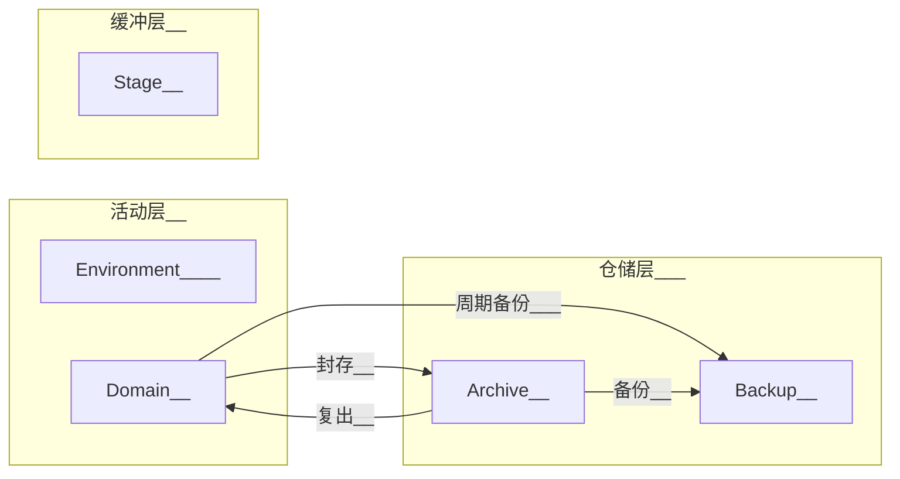
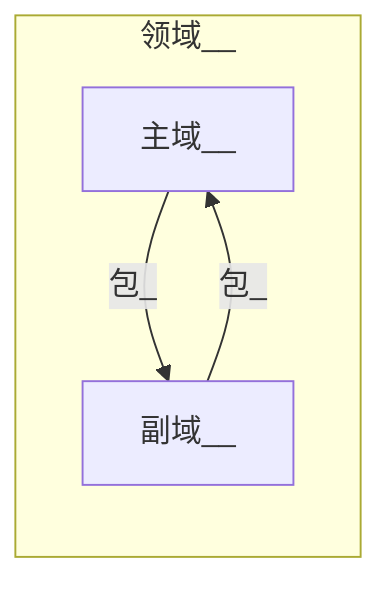

# 前言

以下关键词 MUST、MUST NOT、REQUIRED、SHALL、SHALL NOT、SHOULD、SHOULD NOT、 RECOMMENDED、MAY、OPTIONAL 依照 RFC 2119 的叙述解读。

当文件或文件夹名出现尖括号时```<内容>```，代表这部分需要被替换为合理的值。

# 正文

## 一级结构

一级结构根据**[价值-状态体系](#说明_价值-状态体系)**分为**三层**，进而细分为**五大区**。



| 英文名      | 中文名 | 描述                       | 作用                         |
| ----------- | ------ | -------------------------- | ---------------------------- |
| Stage       | 暂存   | 提供临时空间或存放临时文件 | 中转、实验、临时空间等       |
| Environment | 环境   | 运行所需的基本环境         | 工具、应用、游戏、辅助文件等 |
| Domain      | 领域   | 长期活动领域               | 集合领域资源                 |
| Archive     | 存档   | 非活跃领域存放处           | 暂时封存领域                 |
| Backup      | 备份   | 重要文件的备份             | 容灾                         |

## 二级结构

### <span id='暂存'>Stage</span>

本区域以**前缀**分两类二级结构[示例](#示例_Stage二级结构)

| 结构                        | 命名格式     | 作用                                           |
| --------------------------- | ------------ | ---------------------------------------------- |
| 临时存放文件的文件夹(Stage) | S_<文件夹名> | 固定的临时存放文件区域(一般是应用固定输出路径) |
| 临时文件夹(Temporary)       | T_<文件夹名> | 临时创建(也可随时删除)文件夹                   |

### <span id=环境>==Environment==</span>

==暂无二级命名要求，需要定义类似AppData、Assist_File这些不装软件的目录吗==[示例](#示例_Environment结构)

* 各软件安装于各自的独立文件夹中(建议用软件安装时的默认文件夹名)
* 文件夹命名尽可能由英文字母、数字、下划线组成(不能以数字开头)^有特殊字符的目录容易产生错误^

### <span id='领域'>Domain</span>

本区域有两类二级结构

| 结构 | 命名格式[备注1](#说明_识别号)                 | 存放限制                 | 作用                                           |
| ---- | --------------------------------------------- | ------------------------ | ---------------------------------------------- |
| 主域 | <主域主题>_<主域16位识别号>                   | 无限制                   | 大型主题相关文件的集合[备注](#说明_领域的范围) |
| 副域 | <副域主题>\_<主域16位识别号>\_<副域8位识别号> | 只允许存放[包](#说明_包) | 分散主域文件(分散储存空间压力)                 |

**领域在所有磁盘空间的Domain和Archive分区有[唯一性](#说明_唯一性)**

#### 主域与副域

一个主域可以有多个副域，主域可以将[包](#说明_包)储存到副域中(分散储存空间压力)。

* **包在一个领域(包括主域以及其所有副域)中有[唯一性](#说明_唯一性)**
* 副域(MUST)**只能存放[包](#说明_包)**



#### 领域的内部结构

* **必须(MUST)有[索引](#说明_索引)**
* 其他文件夹/压缩包**命名**(MUST NOT)**不能与[包](#说明_包)冲突**
* [包](#说明_包)(MUST)**只能**放在领域的**一级目录**中(三级结构)

### <span id='存档'>Archive</span>

本区域存放封存中的领域。

#### 封存机制

封存领域时(激活时反之)，必须(MUST)：

* 将领域压缩为压缩包。
* (MUST)添加```A<存档年限>_```前缀。存档年限为四位数年份，超出年限存档可随意删除。(永久存档可以填9999)

* (MUST)添加```_<密钥索引>```后缀。[备注](#说明_加密)

### <span id='备份'>==Backup==</span>

用于备份领域中的重要文件，防患于未然。

#### 简介

一个备份(MUST)只对应一个领域(主域与所有副域)。

#### 命名

```B_<主领域主题>_<备份主题>_<主域识别号>_<8位备份识别号>```——[识别号](#说明_识别号)

#### 结构


==不可变对象Stack，可变对象区域UpdateQueue==


## ==备份==


## <span id='标签'>==标签==</span>


## <span id='说明_加密'>==加密==</span>

### 方式

使用AES-256加密(7zip的加密方式)

勾选 文件名加密

### <span id='说明_加密_密钥索引'>密钥索引</span>


## 自动工具


# 附录

## 说明

### <span id='说明_价值-状态体系'>价值-状态体系</span>

运行此系统最稀缺的资源是**精力**和**磁盘空间**。本体系通过价值和状态两个维度分类，将文件系统分为三层。

缓冲层是低价值/价值待定的文件，一般是临时文件，应尽快处理(清理)。

仓储层是长期封存的文件，无需分散精力于此。

|      |       低/待定价值       |                有价值                 |
| :--: | :---------------------: | :-----------------------------------: |
| 封存 |                         | **仓储层**（**Archive**、**Backup**） |
| 活跃 | **缓冲层**（**Stage**） | **活动层（Domain**、**Environment**） |

### <span id='说明_领域的范围'>领域的范围</span>

人的精力是有限，一般只能同时发展有限个领域。

同时避免创建太多领域，领域的范围一般很广(比如主业、生活影像)，而且有很长的活跃时间(数年甚至数十年)。

> 常见大型主题示例：本科资料、程序开发、个人影像、主业、集散...

### <span id='说明_唯一性'>唯一性</span>

唯一性是指：

* 在**指定范围**中，其识别号(MUST NOT)**不允许重复**。
* 在**指定范围**中，该结构(MUST)**只能同时存在一处地方**。

* (MUST NOT)**不允许改变识别号**。
  * 对于可变结构来说改变识别号相当于删除旧有结构，创建全新结构。
  * 对于不可变结构来说，只有内部文件有变化时才可改变识别号

### <span id='说明_识别号'>识别号</span>

识别号是英文字母与数字组成的随机字符串，是文件/文件夹的通用唯一识别符。

```python
import random
for i in range(40):
 print(str().join(random.choices(
     'abcdefghijklmnopqrstuvwxyzABCDEFGHIJKLMNOPQRSTUVWXYZ0123456789', k=8*(i%2+1))))
```

### <span id='说明_索引'>索引</span>

索引是名为```.fileManagement_Index```文件夹(由FileManagementTool自动创建)，包含

* ```index.yml```——此区域的信息

* ```status.yml```——此区域的文件索引
* ```history.yml```——此区域的修改记录
* ```tag.yml```——此区域通行的[标签](#标签)
* ```backupIgnore.txt```——(领域专有)不需要自动备份的文件

### <span id='说明_包'>包</span>

#### <span id="包">包_简介</span>

**包是不可变结构**

* **(MUST)**必须有[索引](#说明_索引)
* 当包打上识别号或Sha-256时，包的内容**(MUST NOT)**不可再修改
* (RECOMMENDED)建议至少打包多个季度(或者几GB)的内容，避免产生太多包

#### 包_命名

* 文件夹形式命名：```ROF_<标题>_<包识别号(16位)>```——[识别号](#说明_识别号)

* 压缩包形式命名：```ROP_<标题>_<包识别号(16位)>_<密钥索引>```——[识别号](#说明_识别号)、[密钥索引](#说明_加密_密钥索引)

#### 包转换

当包从文件夹形式转换为压缩包形式时(反之)

* 前缀```ROF_```转为```ROP_```
* 将包压缩为.7z压缩包([加密](#说明_加密))
* 添加```_<密钥索引>```后缀([密钥索引](#说明_加密_密钥索引))

## 示例

### <span id='示例_Stage二级结构'>Stage二级结构示例</span>

> S_甲下载器下载目录
>
> S_手机照片自动同步目录
>
> S_待分类
>
> T_甲脚本临时测试区
>
> T_乙压缩包临时解压区

### <span id='示例_Environment结构'>Environment结构示例</span>

> * AppData
>   * qq缓存
>   * TIM缓存
>   * ...
> * Applications
>   * TIM
>   * qq
>   * ...
> * Component
>   * java7
>   * mingw
>   * ...
> * Tools
>   * typora
>   * git
>   * ...
> * Entertainment
>   * minecraft
>   * ...
> * Assist_File
>   * icon
>   * script
>   * ...


