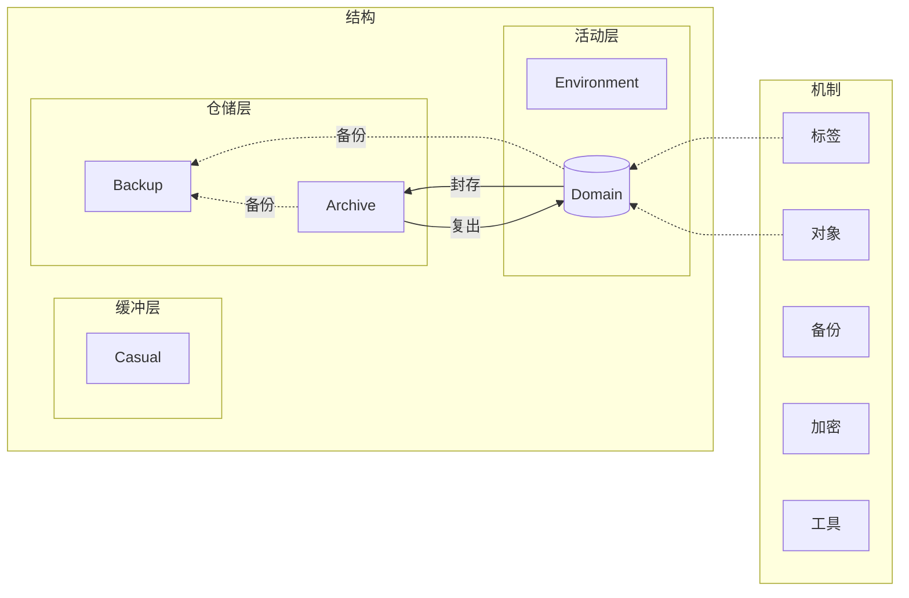

# FileManagement

* 版本——1.0.0-beta
* 声明——TikiEssential节, 许可协议: IceTiki [知识共享 署名-相同方式共享 4.0协议](https://creativecommons.org/licenses/by-sa/4.0/deed.zh) 2021
* 范围——私有储存空间
* 效果——围绕"效率、秩序、安全"标准化文件管理

## 实例

文件列表

> * *.git
> * index.md     >>>>>     模组主体文件的副本
> * backup.md     >>>>>     备份说明

## 调用

### <span id='Security.KeyBankApi()'>Security.KeyBankApi()</span>

Security提供了密钥库，密钥/函数索引可以在**密钥库**中**查询**到对应的密钥/密钥生成函数。

### <span id='Security.StandardMethod()'>Security.StandardMethod()</span>

Security提供标准的加密文件和字符串方法。(AES256参数)

### <span id='Handler.TaskAdd()'>Handler.TaskAdd()</span>

提交backup.md中的任务到Handler中。

## 接口

### DomainApi()

提供了在Domain区 **创建/删除/修改** **领域** 的权限和功能。

### CasualApi()

提供了在Casual区 **创建/删除/访问** **临时文件夹/存放临时文件夹的文件** 的权限和功能。

# 正文

在本文中

* 关键词 MUST、MUST NOT、REQUIRED、SHALL、SHALL NOT、SHOULD、SHOULD NOT、 RECOMMENDED、MAY、OPTIONAL 依照 RFC 2119 的叙述解读。

* 当文件或文件夹名出现尖括号时```<内容>```，代表这部分需要被替换为合理的值。

## 概述

文件管理主要顾及**效率、秩序、安全**。主要分为**结构**和**机制**两部分。

**结构**分为**五大区域**。其中

* **Domain**是五大区域中**最活跃最重要**的。

* Casual仅在有临时需求时使用，Backup与Archive很少使用，Environment主要起辅助作用。

Domain中以[**领域**](#领域)为基本单位。领域是**某主题相关文件集合**，各**领域之间相对独立**保证基本**秩序**。领域内部**自由分类**以提升**效率**。

**领域是一种[对象](#对象)**，创建领域时要注意对象的特性。



## <span id='结构'>结构</span>

个人的各块储存空间^各硬盘分区、网盘等^分别划为五块区域(按需删减)。[注](#说明_结构分区依据)

| 英文名               | 中文名 | 描述                       | 作用                                   |
| -------------------- | ------ | -------------------------- | -------------------------------------- |
| [Domain](#领域)      | 领域   | 长期活动领域               | 集合领域资源                           |
| [Casual](#临时)      | 临时   | 提供临时空间或存放临时文件 | 中转、实验、临时空间等                 |
| [Environment](#环境) | 环境   | 运行所需的基本环境         | 存放软件、辅助文件、脚本等辅佐生产文件 |
| [Archive](#存档)     | 存档   | 非活跃领域存放处           | 暂时封存领域                           |
| [Backup](#备份)      | 备份   | 重要文件的备份             | 容灾                                   |

### <span id='Casual'>Casual</span>

本区域存放临时存放文件的文件夹和临时文件夹[示例](#示例_Casual结构)

| 结构                        | 命名格式     | 作用                                           |
| --------------------------- | ------------ | ---------------------------------------------- |
| 临时存放文件的文件夹(Stage) | S_<文件夹名> | 固定的临时存放文件区域(一般是应用固定输出路径) |
| 临时文件夹(Temporary)       | T_<文件夹名> | 临时创建(也可随时删除)文件夹                   |

### <span id='Environment'>Environment</span>

本区域存放软件等辅助正常工作的事物。

* 本二级结构命名**(MUST)**只能由英文字母、数字、下划线组成(不能以数字开头)^有特殊字符的目录容易产生错误^
* 各软件必须**(MUST)**安装于各自的独立文件夹(三级结构)中(建议用软件安装时的默认文件夹名)[示例](#示例_Environment结构)

### <span id='Domain'>Domain</span>

本区域存放活跃中的[领域](#领域)。


### <span id='Archive'>Archive</span>

本区域存放封存状态下的[领域](#领域)。

### <span id='Backup'>Backup</span>

存放文件备份。

> * 当磁盘空间不足时，会优先清理备份。所以Backup不能作为文件孤本存档处。
> * 备份区是文件运行的容灾机制，所以不做严格规范。

#### 创建备份库

备份库(MUST)是有```B_```前缀的文件夹，存放备份。

一般(MAY)一个[对象](#对象)(以及其所有子对象)对应一个备份库，命名格式(MUST)为```B_<备份库标题>_<备份库识别号(12位)>```

> **相关建议**
>
> 备份库中的内容(MAY)有三大类
>
> 1. 可变对象的增量备份，(RECOMMENDED)建议添加```A_```前缀
> 2. 不可变对象的备份，(RECOMMENDED)建议添加```I<保存年限>_```前缀
> 3. 可变对象的快照备份，(RECOMMENDED)建议添加```M<保存年限>_<备份时间>_```前缀(备份时间的格式建议参照[标准标签](index.assets\template_.fmi\tag_list.yml)中的时间标签(t))

## <span id='对象'>对象</span>

**对象是文件夹**(或可以转化为文件夹的文件(如压缩包))，(MUST)**带有[索引](#说明_索引)和[标识符](#说明_标识符)**。

分为[**不可变对象**](#说明_不可变对象)和[**可变对象**](#说明_可变对象)两种。可变对象内可以(MAY)存放不可变对象，但不可变对象内不能(MUST NOT)储存可变对象。

考虑到储存空间往往不是完整的一块，对象可以(OPTIONAL)[**分散储存**](#子对象)。

## <span id='备份'>备份</span>

备份是(正常工作机制之外的)容灾机制，不强制执行。

全域的详细备份方式以及备份计划记录在[backup.md](#实例)中(无格式要求)，并将其中的任务事项通过[Handler.TaskAdd()](#Handler.TaskAdd())提交到Handler。

## <span id='标签'>标签</span>

标签([格式](#标签格式))是文件信息的摘要，提高文件搜索效率。

* 在对象内部使用标签时，需要(MUST)先将其加入到[索引](#说明_索引)的tag_list.yml。
* [标准标签](index.assets\template_.fmi\tag_list.yml)是必须(MUST)使用的标签，自定义标签可以根据模板编写。
* 考虑到文件名长度限制，过长的信息可以储存在[索引](#说明_索引)的tag_extension.yml。详细方式记录在tag_list.yml中。

## <span id='加密'>加密</span>

文件和字符串的加密方式使用[Security.StandardMethod()](#Security.StandardMethod())。

加密文件都需要(MUST)添加**密钥/函数索引标签**```k```。密钥/函数索引是字符串，注记密码。

密钥/函数索引所对应的真实密钥或密钥生成函数可以在[Security.KeyBankApi()](#Security.KeyBankApi())查询到。


## <span id=工具>工具</span>

https://github.com/IceTiki/TikiEssential_Tools

# 附录

## 说明

### <span id='说明_结构分区依据'>结构分区依据</span>

运行此系统最稀缺的资源是**精力**和**磁盘空间**。本体系通过价值和状态两个维度分类，将文件系统分为三层。

缓冲层是低价值/价值待定的文件，一般是临时文件，应尽快处理(清理)。

仓储层是长期封存的文件，无需关注。

**活动层**是生产、生活的核心，也是本系统的**核心**。

|      |       低/待定价值        |                有价值                 |
| :--: | :----------------------: | :-----------------------------------: |
| 封存 |                          | **仓储层**（**Archive**、**Backup**） |
| 活跃 | **缓冲层**（**Casual**） | **活动层（Domain**、**Environment**） |

### <span id='领域'>领域</span>

命名格式(MUST)为```<主题>_<标识符>```。

#### 领域是可变[对象](#对象)

领域是可变[对象](#对象)，拥有可变对象的所有特性。(MUST)有索引和标识符，(OPTIONAL)可以创建子对象。

#### 领域以主题富集相关文件

创建领域的目的是**富集**某个方面的文件以提高使用**效率**。领域内部文件彼此都有较强的联系。各领域**相对独立**。

> 领域不追求[MECE](https://zh.wikipedia.org/wiki/MECE%E5%8E%9F%E5%88%99)(不重复不遗漏)。
>
> * 以单一的标准分类文件，容易使某些区域文件过多，而某些区域文件过少。不契合使用习惯。
> * 固定的标准无法适应人随时间的变化。

其内部文件分类基本**不作限制**。

> 减少限制，提升效率。

领域一般(SHOULD)涵盖范围广，活跃时间长(数年甚至数十年)。一般(SHOULD)同时活跃的领域不会超过个位数。

> 人的精力一般集中在少数几个较大的方面(比如主业、生活)等。
>
> 对于过大的领域可以考虑拆分(比如将生活拆分为生活影像、生活日记等)
>
> 可以创建“集散”领域，短期感兴趣的项目可以置入集散库中。

#### 领域状态：活跃与封存

领域有两种状态：活跃/封存。分别存放在Domain/Archive中。

领域按照以下步骤转为封存状态时(转为活跃状态时反之)：

* (MUST)添加```A<保存年限>_```前缀。存档年限为四位数年份，超出年限存档即可(MAY)清理。(永久存档填9999)
* (RECOMMAND)建议[加密压缩](#加密)。

* (MUST)将领域从Domain移动到Archive

备注：领域的子对象可以(OPTIONAL)单独封存；但领域的父对象封存时，子对象也必须(MUST)封存。

### <span id='对象说明'>对象说明</span>

#### <span id='说明_索引'>索引</span>

索引是名为```.fmi_<id>```文件夹([模板](index.assets/template_.fmi)，[生成工具](#自动工具))，保存对象的元信息。

* ```index.yml```——此区域的信息
* ```tag_list.yml```——此区域通行的[标签](#标签)列表
* ```tag_extension.yml```——标签的额外信息，见[标签](#标签)

#### <span id='说明_标识符'>标识符</span>

对象都必须(MUST)在文件/文件夹名中标示标识符，可以以```_<标识符>```作为后缀或用```i```[标签](#标签)。

可变对象的标识符格式为```<英文和数字组成，长度为12的随机字符串>```

不可变对象的标识符格式为```<英文和数字组成，长度为16的随机字符串>```

子对象的标识符格式为```<父对象标识符>_<英文和数字组成，长度为8的随机字符串>```

```python
import random
for i in range(60):
    print(str().join(random.choices(
        'abcdefghijklmnopqrstuvwxyzABCDEFGHIJKLMNOPQRSTUVWXYZ0123456789', k=8+4*(i % 3))))
```

#### <span id='说明_不可变对象'>不可变对象</span>

不可变对象的内容不可(MUST NOT)变动，一个标识符对应一份内容。

创建不可变对象或改变其内容时，必须(MUST)新生成[标识符](#说明_标识符)。

#### <span id='说明_可变对象'>可变对象</span>

可变对象的内容可以变动。但在同一时间同一标识符的对象内容必须(MUST)完全相同。

> 换而言之，仅当完全自动同步的文件夹两个文件夹，可以用同一标识符同时出现在两个地方。

#### <span id='子对象'>子对象</span>

对象可以创建子对象以分散储存压力。

子对象空间是**对象(父对象)空间的一部分**，所以<u>子对象</u>空间的<u>一级子文件夹或一级文件</u>**(MUST NOT)**都<u>不能</u>与<u>其他子对象或父对象</u>的一级子文件夹或一级文件<u>重名</u>。

### <span id='标签格式'>标签格式</span>

标签以```#```开始，最后一个标签以```##```结束。标签可以转换为字典。

> 示例格式
>
> > 其他字符**#标签1#标签2#标签3=值3#标签4=值4##**其他字符**#标签5=值5#标签6##**其他字符
>
> 读取为[json](https://zh.wikipedia.org/wiki/JSON)形式
>
> > {"标签1":1,"标签2":1,"标签3":"值3","标签4":"值4","标签5":"值5","标签6":1}

标签分为格式标签(值有强制格式规定)以及自由标签(值没有强制格式规定)

#### 标签的值

标签中的值可以是整数、字符串、列表或字典。(列表和字典可以互相嵌套)

* 标签没有赋值时，其值视为1(整数)
* 字符串不需要符号包裹，纯数字字符串也视作字符串。

* 列表以```[]```包裹，以```,```分割值。

* 字典以```{}```包裹。以```,```分割键值对，以```=```分隔键与值。

若一个标签出现多次，则按出现顺序打包为列表。

#### 转义

转义字符为 ``` ` ```

* 系统文件名保留字符需要转义。(windows: `\ / : * ? " < > |`)
* 以下特殊字符作普通字符时需要转义
  * 转义字符``` ` ```
  * 标签名中的```# =```
  * 字符串中的```#```及作开头的```[```和```{```
  * 字典与列表中的```{ } [ ] = ,```

#### 示例

| 值类型   | 示例格式                                       | 读取为json                                            |
| -------- | ---------------------------------------------- | ----------------------------------------------------- |
| 字符串   | #标签1=这是一个[字符串]#标签2=还是1个,字符串## | {"标签1":"这是一个[字符串]","标签2":"还是1个,字符串"} |
| 列表     | #标签=[这是,3,句话]##                          | {"标签":["这是","3","句话"]}                          |
| 字典     | #标签={年=2021,月=8,日=16}##                   | {"标签":{"年":"2021","月":"8","日":"16"}}             |
| 多次标签 | #标签=[出现,一次]#标签=再次出现##              | {"标签":[["出现","一次"],"再次出现"]}                 |
| 嵌套     | #标签={xxx=12,yyy=[yxx=random]}##              | {"标签":{"xxx":"12","yyy"=["yxx":"random"]}}          |
| 转义     | #标签=\`\[这是一,个字=符\`#串                  | {"标签":"[这是一,个字=符#串"}                         |
| 转义     | #标签=[项\`,目1,项\`]目2]                      | {"标签"=["项,目1","项]目2"]}                          |

## 示例

### <span id='示例_Casual结构'>Casual结构示例</span>

> S_甲下载器下载目录
>
> S_手机照片自动同步目录
>
> S_待分类
>
> T_甲脚本临时测试区
>
> T_乙压缩包临时解压区

### <span id='示例_Environment结构'>Environment结构示例</span>

> * AppData
>   * qq缓存
>   * TIM缓存
>   * ...
> * Applications
>   * TIM
>   * qq
>   * ...
> * Component
>   * java7
>   * mingw
>   * ...
> * Tools
>   * typora
>   * git
>   * ...
> * Entertainment
>   * minecraft
>   * ...
> * AssistFile
>   * icon
>   * script
>   * ...
